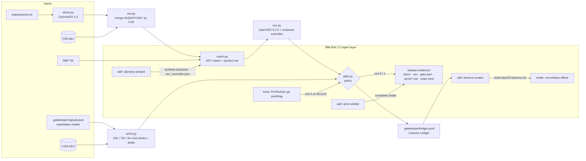

# Architecture

## Design choices
- **Deterministic core, agentic edges.** Decisions that must be auditable are pure functions of their inputs: which versions ship, which advisories apply, and which deadlines are running. Bob handles the judgement work: mapping a new advisory to code, writing the justification, drafting the reports and fixing the code. Every Bob judgement lands in a reviewed JSON file that includes an author and a reason, and it can be rolled back.
- **Blocks on uncertainty.** An advisory nobody has mapped yet (`UNKNOWN`) is treated as `under_investigation`, and that blocks the release. The gate never assumes "not affected".
- **Clocks survive the fix.** Removing the vulnerable version starts the 14-day final-report clock. The 24 h and 72 h obligations stay open until they are marked submitted in `signals.json`.
- **No dependencies.** It uses only the Python ≥ 3.11 standard library, runs offline from cache, and returns the decision as an exit code, so it fits a git hook, CI or a Bob hook alike.
